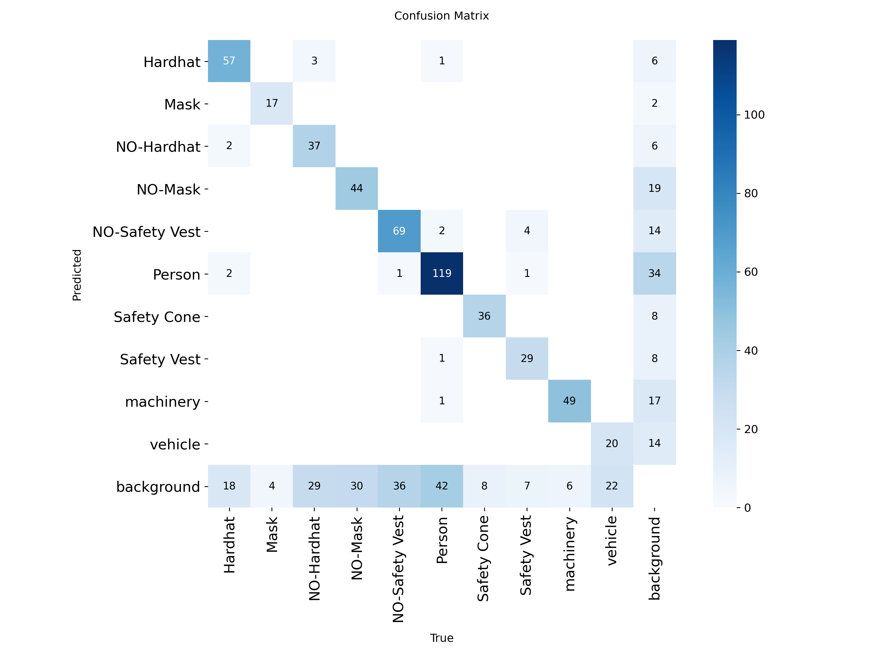

# 👷 EPI Detector — SBrT 2026

> This project develops an intelligent PPE (Personal Protective Equipment) detection system for civil construction sites. It uses a YOLOv8-based architecture, starting from a pre-trained baseline model and evolving towards a custom-trained model with improved robustness against occlusion, luminance variation, and small object detection.
>
> This repository accompanies the paper: **"Real-Time Personal Protective Equipment Detection: A Deep Learning Approach"**, submitted to the XLIV Brazilian Symposium on Telecommunications and Signal Processing (SBrT 2026).

[](.)
[](.)
[](.)
[](.)

---

## 📁 Repository Structure

```
repositorio/
│
├── baseline_model/                         ← Original benchmark (Hansung-Cho)
│   ├── ultralytics_construction_ppe.py     (original inference script)
│   ├── teste.py                            (class listing utility)
│   ├── confusion_matrix.png
│   └── classified_images/                  (baseline inference outputs)
│
├── improved_model/                         ← Proposed system (this work)
│   ├── ppe_inference.py                    (main inference pipeline)
│   ├── experimento_luminancia.py           (luminance robustness experiment)
│   ├── experimento_objetos_pequenos.py     (small object detection experiment)
│   ├── experimento_oclusao.py             (occlusion robustness experiment)
│   ├── fotos_teste/                        (test images — not publicly shared)
│   └── resultados/
│       ├── classified_images/              (improved model outputs)
│       ├── luminancia/                     (luminance experiment results)
│       ├── objetos_pequenos/               (small object experiment results)
│       └── oclusao/                        (occlusion experiment results)
│
└── README.md
```

> ⚠️ **Note:** Images inside `fotos_teste/` are not publicly available. Part of the dataset consists of photographs taken at a private construction site and were not authorized for public distribution.

---

## 🦺 Baseline Model (`baseline_model/`)

The benchmark model was proposed by Hansung-Cho and is publicly available on Hugging Face:
🔗 https://huggingface.co/Hansung-Cho/yolov8-ppe-detection

It is based on YOLOv8 and was fine-tuned to detect the following classes in construction site images:

`Hardhat` · `Mask` · `NO-Hardhat` · `NO-Mask` · `NO-Safety Vest` · `Person` · `Safety Cone` · `Safety Vest` · `machinery` · `vehicle`

In this project, only the following classes are used:

`Hardhat` · `NO-Hardhat` · `NO-Safety Vest` · `Person` · `Safety Vest`

### 📊 Baseline Performance

Metrics extracted from the model's confusion matrix on our custom test set:

| Class | TP | FP | FN | Precision | Recall |
|---|---|---|---|---|---|
| Hardhat | 57 | 10 | 22 | 85.07% | 72.15% |
| NO-Hardhat | 37 | 8 | 32 | 82.22% | 53.62% |
| NO-Safety Vest | 69 | 16 | 40 | 81.18% | 63.30% |
| Person | 119 | 36 | 44 | 76.77% | 73.01% |
| Safety Vest | 29 | 9 | 8 | 76.32% | 78.38% |



### 🚫 Baseline Limitations

As noted by the original author and confirmed during our tests:
- **Domain bias** between training data and real construction site photos
- **Occlusion** — workers partially hidden behind obstacles are frequently missed
- **Low-resolution / distant objects** — detections degrade significantly at distance
- **Luminance variation** — performance drops under poor or excessive lighting

---

## 🔬 Improved Model (`improved_model/`)

Our proposed system builds on the baseline with three main contributions:

1. **Improved filtering pipeline** — configurable confidence threshold (`--min-conf`) and bounding box size threshold (`--min-box`) via CLI
2. **Experimental robustness analysis** — three systematic experiments quantifying model behavior under luminance variation, occlusion, and object scale
3. **Foundation for fine-tuning** — structured pipeline ready for training a custom model on a combined public + private dataset

### ⚙️ Installation

```bash
pip install ultralytics huggingface_hub opencv-python pandas matplotlib
```

### ▶️ Running the Main Inference

```bash
cd improved_model
python ppe_inference.py --input fotos_teste --output resultados/classified_images
```

| Argument | Default | Description |
|---|---|---|
| `--input` | `fotos_teste` | Folder with input images |
| `--output` | `classified_images` | Output folder |
| `--min-box` | `30` | Minimum bounding box size (px) |
| `--min-conf` | `0.25` | Minimum detection confidence (0–1) |

---

## 🧪 Experiments

All experiments take images from `fotos_teste/` and save results (CSV + charts) to `resultados/`.

### 1. Luminance Variation

Isolates the luminance channel (V in HSV color space) and scales it from 0.1× to 1.5× to determine the minimum lighting threshold for reliable detection.

```bash
python experimento_luminancia.py --input fotos_teste --output resultados/luminancia
```

**Outputs:** CSV with detections per luminance level · bar+line chart · visual grid of all levels applied

### 2. Small Object Detection

**A) Distance simulation:** downscale + upscale at factors `[1.0 → 0.15]` to simulate distant cameras.  
**B) Threshold analysis:** sweeps `min_box` from 0 to 60 px to find the best recall vs. false-positive tradeoff.

```bash
python experimento_objetos_pequenos.py --input fotos_teste --output resultados/objetos_pequenos
```

**Outputs:** Two CSVs · three PNG charts · per-size-category breakdown (small/medium/large per COCO standard)

### 3. Occlusion Robustness

Applies three synthetic occlusion types at intensities from 0% to 50% of image area:

| Type | Simulates |
|---|---|
| Random blocks | Scaffolding, boxes, random obstacles |
| Horizontal stripes | Fences, grilles, horizontal beams |
| Vertical stripes | Columns, pillars, posts |

```bash
python experimento_oclusao.py --input fotos_teste --output resultados/oclusao
```

**Outputs:** CSV · detection chart · confidence chart · visual sample grid

---

## 🗺️ Next Steps

- [ ] Label construction site photos using [Roboflow](https://roboflow.com) (YOLOv8 format)
- [ ] Combine public dataset with private photos for fine-tuning
- [ ] Train custom model: `yolo train model=yolov8m.pt data=dataset.yaml epochs=100 imgsz=640`
- [ ] Compare fine-tuned model vs. baseline using the same experiment scripts
- [ ] Expand class set (Gloves, Safety Boots, Safety Glasses)

---

## 📚 Citation

If you use this work, please cite:

```
Brandão, T. C., Esteves, I., Bustamante, T., Mendes, B., Fernandes, R. P., Silva, C. J. A.
"Real-Time Personal Protective Equipment Detection: A Deep Learning Approach."
XLIV Brazilian Symposium on Telecommunications and Signal Processing (SBrT 2026),
Salvador, BA, September–October 2026.
```

Baseline model:
```
Cho, Hansung. "YOLOv8 PPE Detection – End-to-End AI System for Safety Monitoring."
Hugging Face Model Hub, 2025. https://huggingface.co/Hansung-Cho/yolov8-ppe-detection
```
